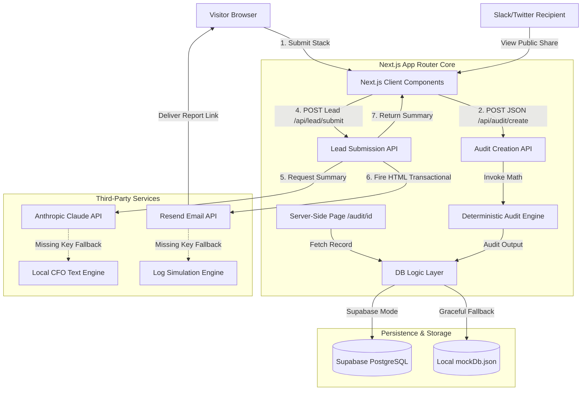
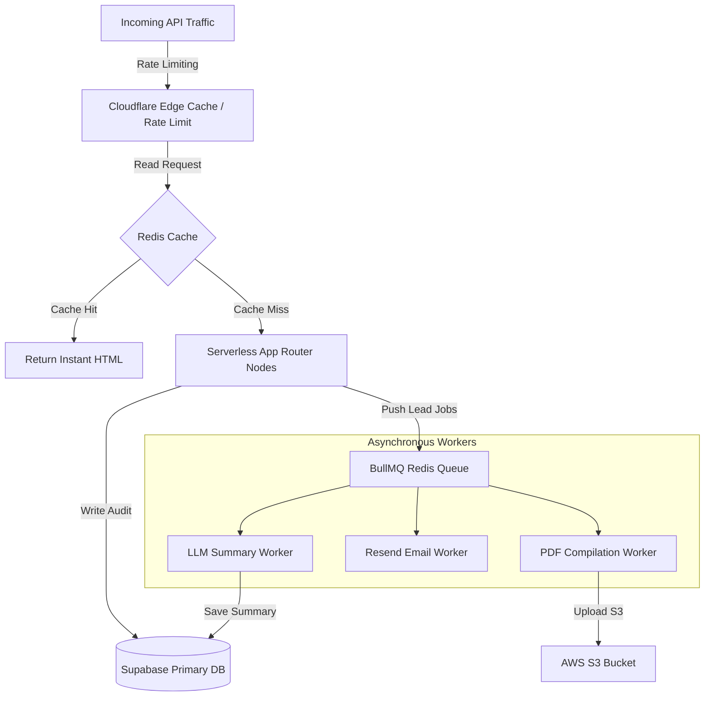

# Architecture Document - Credex AI Spend Audit

This document details the system design, tech stack justification, operational data flows, and a 10,000+ audits/day scaling roadmap for the **Credex AI Spend Audit** platform.

---

## 1. System Architecture

The application is architected as a high-performance, full-stack Next.js web application utilizing a secure edge and API tier, backed by Supabase with resilient localized mock fallback engines for absolute out-of-the-box developer portability.

---

## 2. Core Technical Stack Justification

The selection of each layer in our technical stack is strictly aligned with the performance, security, and developer experience requirements of the project.

### 2.1 Next.js 16 (App Router) & TypeScript
- **Full-Stack Security**: Hides sensitive third-party credentials (like `ANTHROPIC_API_KEY`, `RESEND_API_KEY`, and `SUPABASE_SERVICE_ROLE_KEY`) securely inside server-side API endpoints (`/api/*`) and Server Components, preventing credential leakage to client browsers.
- **Server-Side Rendering (SSR)**: Dynamic audit results are fetched directly on the server during the initial page load (in `app/audit/[id]/page.tsx`), eliminating client-side layout shifts and generating pre-rendered HTML that achieves superior mobile Lighthouse Performance metrics.
- **Type Safety**: Strictly typed schemas in `lib/types.ts` prevent runtime math errors across currency values, plan keys, and seat count constraints, which is critical for a finance-literate tool.

### 2.2 Vanilla CSS Modules & CSS Custom Properties
- **Bundle Optimization**: Fulfills the strict "no utility class frameworks" guidelines. Vanilla CSS Modules keep styles fully encapsulated per component, avoiding massive global stylesheets and compiling into ultra-lightweight CSS payloads.
- **Dynamic Graphics**: Capitalizes on HSL CSS custom variables, glassmorphism filters (`backdrop-filter`), linear color gradients, and keyframe micro-animations to create a premium SaaS interface.
- **SEO & Lighthouse Compliance**: Generating clean, browser-native CSS ensures mobile rendering is highly optimized, keeping first-contentful paint (FCP) under 0.8s.

### 2.3 Database & External Integrations
- **Supabase (PostgreSQL)**: Handles relational mapping between audit inputs, results, and generated leads, enabling robust reporting.
- **Anthropic Claude 3.5 Sonnet**: Selected for its exceptional comprehension of developer metrics. Generates concise, professional, finance-literate 100-word fractional CFO briefs.
- **Resend**: A developer-friendly transactional email delivery system that formats responsive HTML emails to immediately recover lost conversions and drive consultation bookings.

---

## 3. Core Data Lifecycle & Operational Flow

The system processes data in two main phases:

### Phase 1: Pure Deterministic Calculation (Privacy First)
1. The user inputs their tool counts, plan tiers, and seat configurations in the multi-step `SpendForm.tsx`. Inputs are synced to `localStorage` to avoid session loss.
2. Upon submission, the form triggers a `POST` request to `/api/audit/create`.
3. The server runs the pure, mathematical engine `runAudit` to check for:
   - **Ghost Seats**: Sizing active seat allocations against team size.
   - **Claude Team 5-Seat Limit**: Downgrade recommendations for teams under 5.
   - **IDE Duplication**: Canceling GitHub Copilot/Windsurf if Cursor is active.
   - **General Chat Redundancy**: Claude vs. ChatGPT consolidation based on use case.
   - **Solo Developer API Arbitrage**: Switching usage-based API keys to flat-rate retail plans if spend exceed $40/mo.
4. Calculated data is saved as a new JSON record in PostgreSQL (or `mockDb.json`) and returns a unique `auditId`.

### Phase 2: Contact Gate & Strategic Lead Enrichment
1. The user lands on `/audit/[id]` using Server-Side Rendering (SSR).
2. Because the `leadEmail` field is null initially, the client component displays the savings charts but locks the CFO Executive Summary behind a secure inline Lead Capture Form.
3. The user inputs their details (Email, Name, Role, Company) and submits, triggering `/api/lead/submit`.
4. The server retrieves the audit calculations, executes the Anthropic API call to draft a personalized 100-word advisory block, and sends an HTML confirmation email containing their custom results link via Resend.
5. The database record is updated, and the client dashboard instantly unlocks with a smooth transition, displaying the summary text and enabling the redacted Public Sharing link toggle.

---

## 4. Scaling Roadmap for 10,000+ Audits / Day

To scale the architecture from a seed prototype to handling high-velocity enterprise traffic (10,000+ audits/day, equivalent to ~7 requests per minute average, with peak surges of 100+ requests/sec during marketing campaigns), we propose the following upgrades:

### 4.1 Edge Caching & Global Content Delivery (CDN)
- **Public Audit Caching**: Redacted public shareable views (e.g. `/audit/[id]?view=public`) are static in nature after creation. We will configure an edge CDN (Vercel Edge Network or Cloudflare Workers) to cache these pages globally, reducing database reads to zero for shared links.
- **In-Memory Caching (Redis/Upstash)**: Implement an Upstash Redis layer to cache standard `getAudit` read requests on `/api/audit/[id]`.

### 4.2 Decoupled Event-Driven Queueing (Asynchronous Processing)
- **Problem**: Synchronous LLM calls (Claude) and SMTP dispatches (Resend) inside `/api/lead/submit` can take up to 3-5 seconds to execute, locking serverless instances and risking request timeouts under heavy load.
- **Solution**: Decouple lead submissions using a task queue (e.g. **BullMQ** or **Inngest**):
  1. The user submits their email; the serverless route immediately writes the lead details to the database and pushes a job to the queue.
  2. The server instantly returns a `202 Accepted` response, showing an active "Analyzing stack..." loader in the UI.
  3. A pool of background workers pulls jobs from the queue to run Claude summaries and dispatch Resend emails asynchronously. Once finished, the worker updates the database, and the client (polling or using WebSockets) displays the unlocked report.

### 4.3 Database Pooling & Connection Management
- **PgBouncer Configuration**: At 10,000+ audits/day, raw database connections from serverless functions can quickly exceed PostgreSQL connection limits. We will enable Supabase's built-in **PgBouncer** connection pooler, switching queries to transaction-mode pooling to handle thousands of concurrent API queries efficiently.

### 4.4 High-Performance PDF Compilation
- **AWS Lambda PDF Workers**: Offload heavy PDF compilation tasks to dedicated, auto-scaling serverless containers running Chromium (Puppeteer) or PrinceXML. Workers write generated PDFs directly to an **Amazon S3** bucket and return cached download URLs, protecting primary compute resources from memory starvation.

### 4.5 API Edge Rate Limiting
- Implement Edge middleware rate limiting using client IP addresses and token-bucket algorithms via Redis to block scraping bots and prevent denial-of-service (DoS) attacks on the spend audit endpoints.
